# User Guide
## Campus Service Request Management System

This guide explains how to install, start and use the Campus Service Request Management System, a console (command-line) program for reporting and tracking campus service problems at Divine Word University.

---

## 1. Installation Requirements

| Requirement | Details |
|---|---|
| Node.js | Version 20 or later. Check with `node -v` in a terminal. Download the LTS version from nodejs.org if needed. |
| Operating system | Windows, macOS or Linux |
| Terminal | Windows: Git Bash, PowerShell or Command Prompt. macOS/Linux: Terminal |
| Internet | Not needed to run the program (no third-party packages) |

## 2. Setup Instructions

1. Download the project, either by cloning the repository or by unzipping the submitted ZIP file:
   ```bash
   git clone https://github.com/PhileKIRA/IS305-DWU220538.git
   ```
2. Open a terminal in the project folder:
   ```bash
   cd IS305-DWU220538/AT3_CampusServiceRequestSystem
   ```
3. Prepare the project (no packages are downloaded):
   ```bash
   npm install
   ```
4. *(Optional)* Reset the sample data. This **replaces** the files in `data/` with simulated users and requests:
   ```bash
   npm run seed
   ```

## 3. Starting the Application

```bash
npm start
```

(or `node src/CampusServiceApp.js`)

The program loads the saved data and shows the main menu:

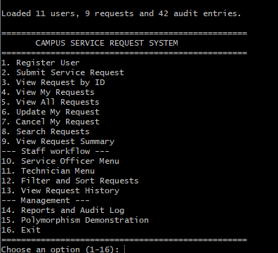

```text
Loaded 11 users, 9 requests and 42 audit entries.

==================================================
       CAMPUS SERVICE REQUEST SYSTEM
==================================================
1. Register User
2. Submit Service Request
3. View Request by ID
4. View My Requests
5. View All Requests
6. Update My Request
7. Cancel My Request
8. Search Requests
9. View Request Summary
--- Staff workflow ---
10. Service Officer Menu
11. Technician Menu
12. Filter and Sort Requests
13. View Request History
--- Management ---
14. Reports and Audit Log
15. Polymorphism Demonstration
16. Exit
==================================================
```

Type a number and press **Enter**. When a list of options is shown, type the option's number. Your work is saved automatically after every action. Choose **16** to exit.

### Sample users (after `npm run seed`)

| User ID | Name | Role |
|---|---|---|
| DWU2026001 | Mary Kila | Student |
| DWU2026014 | John Waim | Student |
| STF101 | Peter Sale | Staff |
| OFF001 | Paul Agi | Service Officer (ICT Services) |
| OFF002 | Helen Tamb | Service Officer (Facilities and Estates) |
| TECH001 | Ken Bais | Technician (Networking) |
| TECH002 | Rose Lai | Technician (Electrical and Plumbing) |
| TECH003 | Michael Yawa | Technician (Cleaning and Sanitation) |
| ADM001 | Ann Mek | System Administrator |

## 4. Registering or Selecting a User

There are no passwords. You "select" yourself by typing your user ID whenever the program asks for it.

To register a new user, choose **1. Register User** and enter:
1. A unique user ID (e.g. `DWU2026050`)
2. First and last name
3. A valid email address
4. The user type: Student, Staff, Service Officer, Technician or System Administrator
5. The extra details for that type: programme and year level (Student), department (Staff), service section (Service Officer) or technical speciality (Technician)

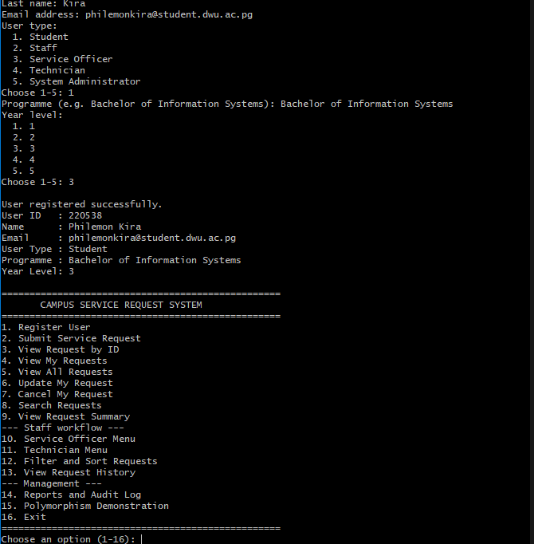

## 5. Submitting a Request

Choose **2. Submit Service Request**, then:
1. Enter your user ID.
2. Choose the category: ICT Support, Facilities Maintenance, Cleaning and Sanitation, or General Campus Service.
3. Enter a title, description and campus location.
4. Choose a priority (press Enter for Normal).
5. Answer the questions for that category, e.g. device type and network impact for ICT Support.

The new request gets an ID such as `REQ010` and the status **Submitted**. Its summary shows the priority score and the target time for that type of request.

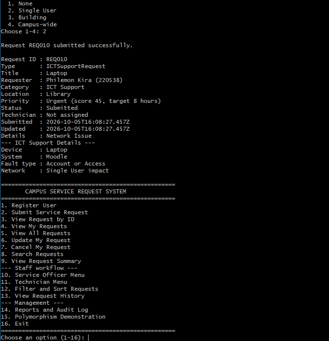

### Viewing, updating and cancelling your requests

| Option | What it does |
|---|---|
| 3. View Request by ID | Shows one request in full |
| 4. View My Requests | Lists all requests submitted by a user ID |
| 5. View All Requests | Lists every request |
| 6. Update My Request | Change the title, description, location or priority. Press Enter to keep a value. Only the requester, and only while the request is *Submitted*. |
| 7. Cancel My Request | Cancels your request after you confirm with `y`. Only the requester, and only while *Submitted*. |

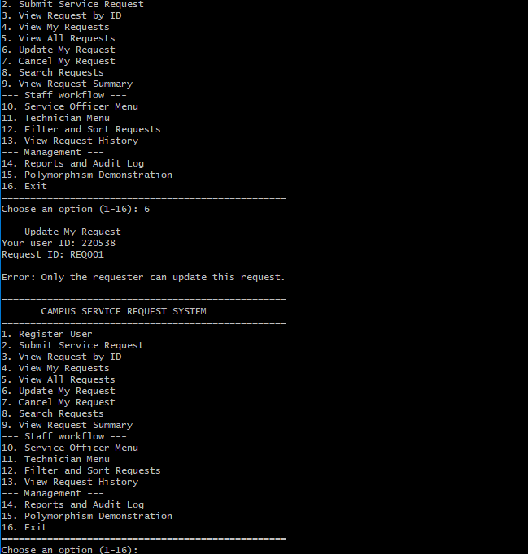

## 6. Assigning and Processing a Request

Requests move through these statuses:

```text
Submitted → Reviewed → Assigned → In Progress → Resolved → Closed
```

### Service Officer (option 10)
Enter your Service Officer ID, then choose:
1. **Review a Submitted request:** Submitted → Reviewed
2. **Set request priority:** for Reviewed or Assigned requests
3. **Assign a Technician:** the list of Technicians is shown; Reviewed → Assigned
4. **Verify and close a Resolved request:** Resolved → Closed
5. **View requests waiting for action**

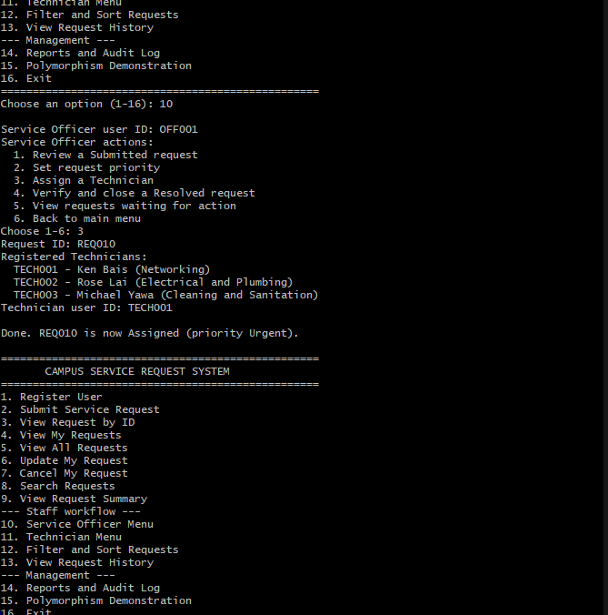

### Technician (option 11)
Enter your Technician ID, then choose:
1. **View my assigned requests**
2. **Begin work:** Assigned → In Progress
3. **Add progress note:** while In Progress
4. **Resolve request:** In Progress → Resolved

Only the Technician assigned to a request can work on it.

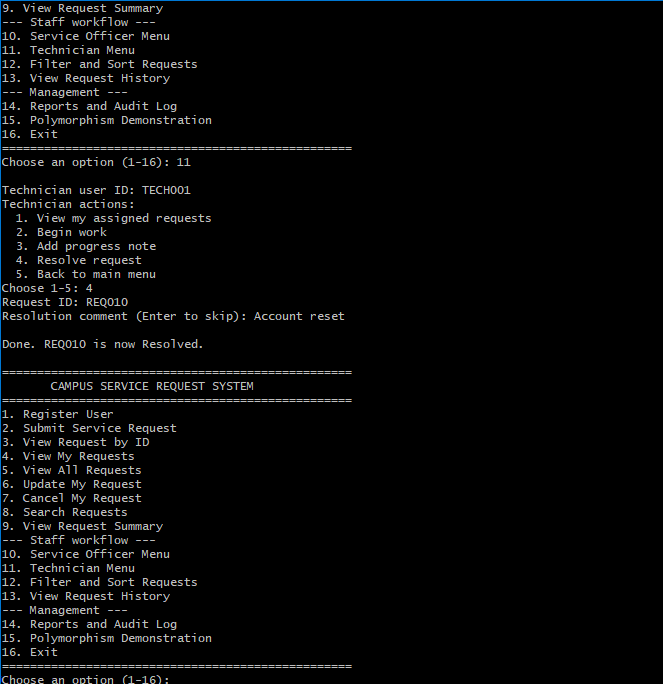

### Request history (option 13)
Enter a request ID to see every step: what changed, who did it, their role, the comment and the time.

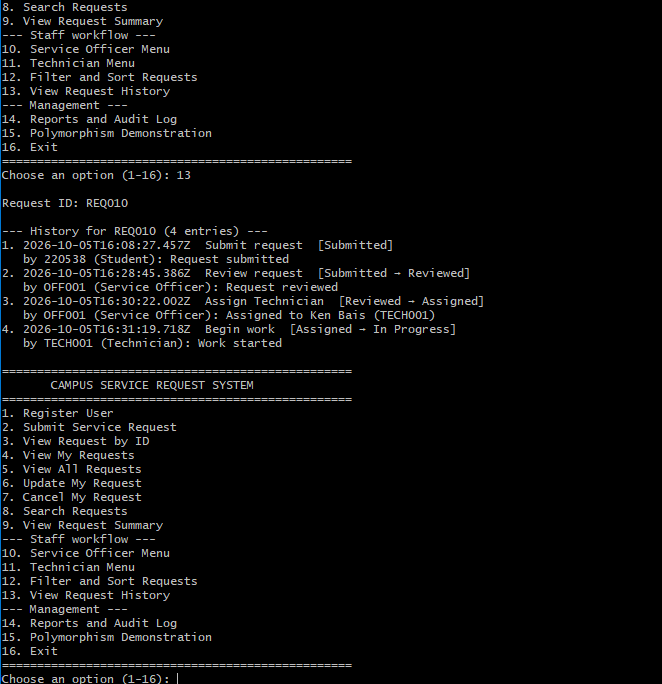

## 7. Searching and Generating Reports

### Search (option 8)
Type part of a title or a request ID, e.g. `wi-fi` or `REQ003`. The search ignores upper and lower case.

### Filter and sort (option 12)
1. Filter by category, status, priority or assigned Technician, or choose no filter.
2. Sort by date submitted (oldest or newest first), or by priority (most urgent first).

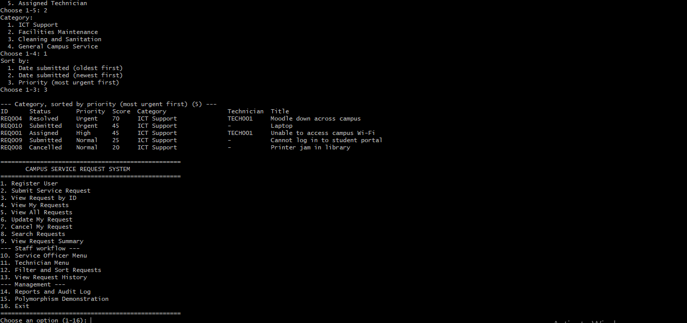

### Request summary (option 9)
Shows how many requests are in each status.

### Reports and audit log (option 14)
Only a **System Administrator** or **Service Officer** can open this menu. Enter your ID, then choose:
- **Management reports:** requests by status, category and priority; urgent open requests; overdue requests; requests per Technician; completed requests per Technician; average resolution time; requests by campus location.
- **Audit log:** every important action, who did it, when, and whether it succeeded or was rejected.

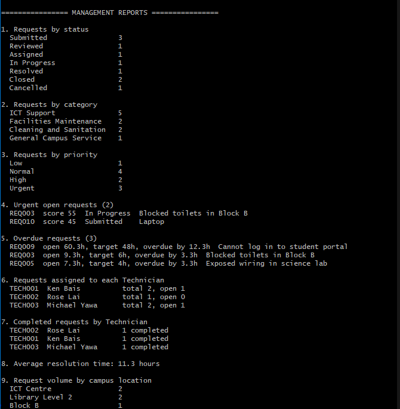
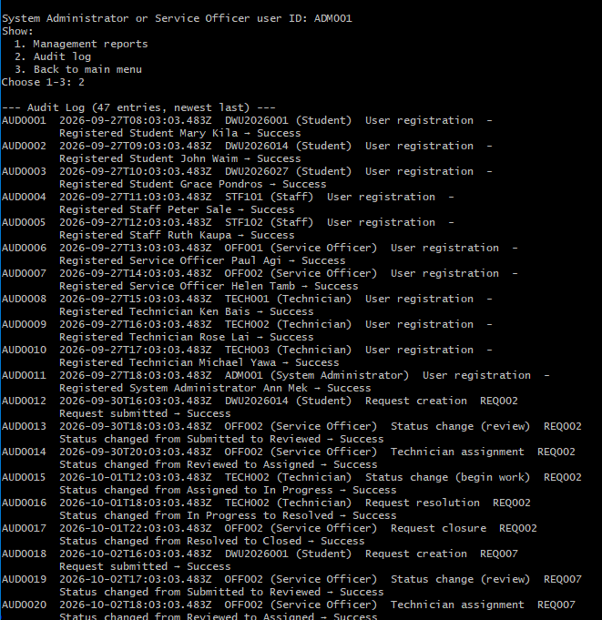

### Polymorphism demonstration (option 15)
Shows how every request in the system answers the same three questions (summary, priority score, target hours) in its own way.

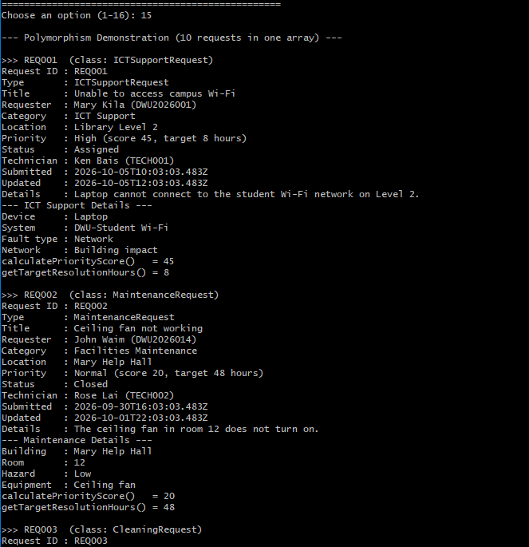

### Data is kept after closing
All changes are saved to the `data/` folder automatically. Exit with **16**, start the program again, and your users and requests are still there.

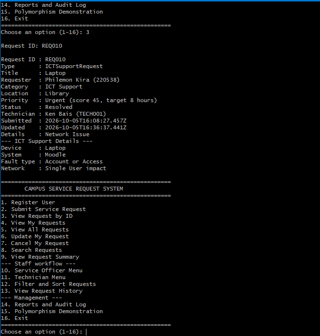

## 8. Common Errors and Solutions

| Message | Cause | Solution |
|---|---|---|
| `Error: User not found. Please register first (option 1).` | The user ID was typed wrongly or is not registered | Check the ID (option 5 lists requests with IDs) or register with option 1 |
| `Error: User ID already exists.` | Another user already has that ID | Choose a different user ID |
| `Error: Invalid email address.` | The email is missing `@` or a domain | Enter an address like `name@dwu.ac.pg` |
| `Error: Request not found.` | Wrong request ID | Use option 5 or 8 to find the correct ID (e.g. `REQ003`) |
| `Error: Only the requester can update this request.` | You are not the person who submitted it | Only the requester can change their own request |
| `Error: Only Submitted requests can be updated (current status: Reviewed).` | Staff have already started handling the request | Contact the Service Officer instead |
| `Error: Only a Service Officer can review requests.` | The ID entered is not a Service Officer | Use a Service Officer ID (e.g. `OFF001`) |
| `Error: Only the assigned Technician can start work on this request.` | A different Technician was assigned | Use the assigned Technician's ID (shown in the request summary) |
| `Error: Invalid status change: Submitted → Closed is not allowed.` | Steps were skipped | Follow the order: review → assign → begin work → resolve → close |
| `Error: Only a System Administrator or Service Officer can view reports and the audit log.` | A requester or Technician tried option 14 | Use an administrator or officer ID (e.g. `ADM001`) |
| `Error: Please choose a number from 1 to 16.` | The menu choice was not a listed number | Type one of the numbers shown |
| `Error: Could not read users.json: the file is not valid JSON.` | A data file was edited by hand and broken | Restore the file (e.g. with `git checkout data/users.json`) or run `npm run seed` to recreate sample data |
| `Error: Could not save ...` | The `data/` folder is read-only or the disk is full | Fix the folder permissions. Your changes stay in memory and are saved after your next action |
| `node: command not found` / `'node' is not recognized` | Node.js is not installed | Install Node.js 20 or later and open a new terminal |
